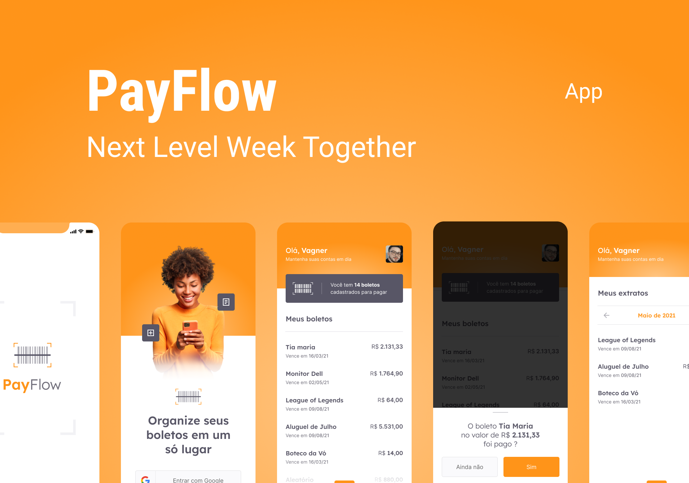

<h1 align="center">
  
</h1>

<p align="center">
  <a href="#-projeto">Sobre o Projeto</a> •
  <a href="#-layout">Layout</a> •
  <a href="#-guia-de-instalação-e-execução">Guia de instalação</a> •
  <a href="#-tecnologias">Tecnologias</a>
</p>

## 💻 Projeto

O projeto PayFlow foi desenvolvido na Next Level Week Together 💜. <br />
O PayFlow se trata de um app mobile feito em Flutter 💙 para Gerenciamento de Boletos, contendo recursos como o uso de câmera e galeria, Machine Leaning com MLKit, Firebase Core e SignIn, Animações e Estilizações Personalizadas, entre vários outros pontos, como o uso do SharedPreferences.

## 🎨 Layout

<p align="center">
  <a href="https://www.figma.com/file/ZExo5QJePzYCjUuElxVkQh/PayFlow?node-id=50322%3A847">
    
  </a>
</p>

## 📚 Guia de instalação e execução

Clone o projeto e acesse a pasta do mesmo.

```bash
$ git clone https://github.com/vagnereix/payflow
$ cd payflow
```

Para iniciá-lo, siga os passos abaixo:

```
$ flutter pub get
$ flutter run
```

## 🚀 Tecnologias

Esse projeto foi desenvolvido com as seguintes tecnologias:

- [Flutter]()
- [Firebase]()
- [MLKit]()
- [AnimationCard]()

##

<p align="center">
Feito com 💙&nbsp;e ☕&nbsp;por <a href="https://github.com/vagnereix">Vagner Reis</a>
</p>
